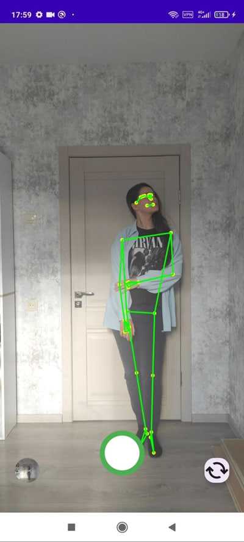
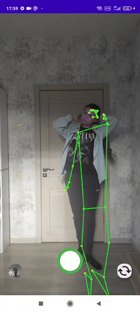

# Auto Photo Capture

Android-приложение для автоматической съёмки на основе анализа стабильности позы и эстетического качества изображения.  
Система обрабатывает видеопоток в реальном времени и инициирует захват кадра, когда объект съёмки находится в устойчивом положении и обладает высокой визуальной привлекательностью.

---

- **Интеллектуальный триггер съёмки**  
  Многокритериальная система принятия решений, объединяющая стабильность позы, эстетический скоринг и адаптивную задержку между срабатываниями.

- **Анализ позы человека**  
  MediaPipe Pose Landmarker для отслеживания 33 ключевых точек скелета и детекции устойчивых положений.

- **Оценка эстетического качества**  
  Нейросетевая модель NIMA (TFLite), оценивающая визуальную привлекательность кадра по шкале 1–10.

- **Обработка в реальном времени**  
  Оптимизированный пайплайн: ~9–10 FPS на устройствах среднего класса (Redmi Note 9 Pro).

- **Эффективное использование ресурсов**  
  Разделение потоков ImageAnalysis и ImageCapture исключает блокировки UI.

- **Гибридный интерфейс**  
  Jetpack Compose + Android Views для визуализации позы.

- **Гибкая конфигурация**  
  Все параметры вынесены в `AutoCaptureProcessor.Config`.

---
## Технология захвата

Для минимизации задержки между моментом принятия решения и сохранением файла используется режим Zero Shutter Lag (ZSL) из библиотеки CameraX. Это позволяет сохранять кадр, максимально близкий по времени к срабатыванию триггера, избегая размытия из-за движения после нажатия виртуальной кнопки.

---

## Требования

- Android Studio Flamingo или новее
- JDK 17
- Android API 26+
- Устройство с камерой или эмулятор с поддержкой камеры

---

## Сборка и запуск

```bash
# Клонирование репозитория
git clone https://github.com/PolinaBoeva/auto-photo-capture.git
cd auto-photo-capture

# Сборка проекта
./gradlew assembleDebug

# Установка на устройство
./gradlew installDebug
```
---

## Структура проекта

```text
app/
├── src/main/java/com/example/autophotopose/
│   ├── ui/
│   │   ├── CameraScreen.kt          # Точка входа Compose UI
│   │   ├── CameraButtons.kt         # Панель управления (Compose)
│   │   ├── OverlayView.kt           # Визуализация позы (Custom View)
│   │   └── AestheticPredictor.kt    # Обёртка TFLite-модели
│   ├── AutoCaptureProcessor.kt      # Ядро логики триггера
│   ├── PoseLandmarkerHelper.kt      # Интеграция MediaPipe
│   ├── PersonFocusController.kt     # Модуль автофокуса
├── src/main/assets/
│   └── nima_aesthetic_mobilenet.tflite  # Модель оценки эстетики
└── build.gradle
```

---

## Use Case

Основной сценарий использования - автоматическая съёмка в режиме self-photo, где момент фиксации кадра определяется системой без участия пользователя. Решение принимается на основе анализа композиционной стабильности сцены и визуального качества изображения.

---

## Принцип работы

Система реализована как событийный пайплайн поверх непрерывного анализа видеопотока:

- Детекция позы: в реальном времени отслеживаются 33 ключевые точки скелета и вычисляются характеристики движения
- Анализ стабильности: сцена считается устойчивой при низкой скорости изменения позы в течение ~200 мс
- Оценка качества: стабильные кадры дополнительно оцениваются нейросетевой моделью эстетики (1–10)
- Принятие решения: срабатывание происходит при одновременном выполнении условий:
  - стабильная поза  
  - высокий эстетический скор  
  - соблюдение cooldown-интервала  

---

## Рекомендации для съёмки

Для корректной работы системы рекомендуется:

- расстояние до камеры: 1.5–2 м
- равномерное фронтальное освещение без сильных теней
- удержание позы 4+ секунды для стабилизации

Не рекомендуется:
- резкие движения и частая смена поз
- сцены с сильной контрастностью или низким освещением

---

## Интерфейс и обратная связь


На рисунке представлен интерфейс приложения. На экране отображается визуализация ключевых точек позы человека, полученных с помощью модели анализа позы. 

• В нижней части по середине расположена кнопка автоматической съёмки с индикатором активности (зелёная обводка). 

• Справа находится кнопка переключения камеры (фронтальная/основная)

• Слева - кнопка перехода в галерею с миниатюрой последнего сохранённого изображения.

---

## Демонстрация работы



---

## Управление изображениями

Все снимки сохраняются локально в директорию:

Pictures/AutoPose/

Последний кадр доступен через интерфейс приложения, также поддерживается просмотр и экспорт через стандартную галерею Android.

---

## Результаты исследования

Экспериментальная оценка показала:

- производительность: ~9–10 FPS (устройства среднего класса)
- F1-score детекции стабильности: 0.82 (относительно ручной разметки)
- задержка принятия решения: < 70 мс
- частота срабатываний: < 4% от общего числа кадров

Результаты подтверждают устойчивость событийной модели и ориентацию системы на выбор только наиболее значимых моментов сцены, что подтверждает событийный характер алгоритма и его ориентацию на выделение только наиболее значимых моментов сцены.
